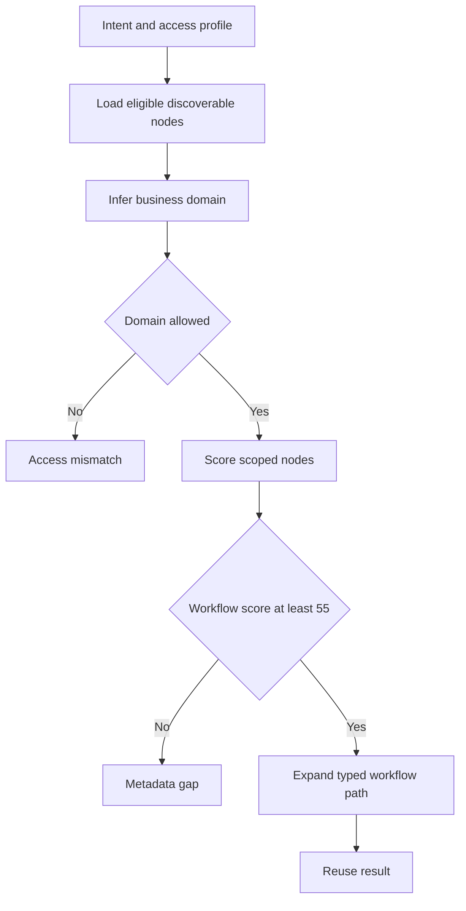

# Explainable catalog discovery

`studio.discovery.discover_catalog()` is a deterministic pre-composition boundary. It converts a free-text request and a **simulated** discovery profile into an explainable `DiscoveryResult`. It does not query a source system, grant an entitlement, create a proposal, or call a model. Its purpose is to show that reuse and catalog gaps are decided from registered metadata before agent design begins.

The result is rendered by `views.discover` at `POST /catalog/discover`. The workspace can copy a runnable commercial-loan result into the proposal form; the subsequent proposal still follows [the proposal lifecycle](../workflows/proposal-lifecycle.md).

This is a metadata workflow. An access mismatch means the selected profile cannot discover that domain; it is explicitly not a production authorization decision.

## Inputs, scope, and decisions

`DiscoveryForm` accepts intent and one key from `DISCOVERY_PROFILE_CHOICES`. `ACCESS_PROFILES` defines each profile's domain set and maximum classification:

| Profile | Eligible domains | Maximum classification |
|---|---|---|
| `enterprise_architect` | All catalog domains | `restricted` |
| `treasury_seller` | Enterprise and treasury | `internal` |
| `retail_specialist` | Enterprise and retail | `internal` |
| `servicing_analyst` | Enterprise and commercial loan | `restricted` |

The catalog query first restricts `OntologyNode` records to `DATA_PRODUCT`, `WORKFLOW`, `AGENT_INSTANCE`, or `AGENT_CAPABILITY` nodes with `approved` or `conditional` state. `_infer_domain()` scores phrases from `DOMAIN_CONCEPTS`. `_is_eligible()` applies the profile's domain/classification constraints before `_score_node()` ranks matching domain and enterprise nodes. The top eight are retained; a workflow must score at least 55 to anchor reuse.

| `DiscoveryDecision` | Trigger | Behavior |
|---|---|---|
| `reuse` | Inferred domain is allowed and has a qualifying workflow | Graph-expand its products, agent instance, and capabilities. |
| `access_mismatch` | Inferred domain is outside the profile | Return no ranked objects and instruct the user to request the domain-owner path. |
| `metadata_gap` | No confident domain or no qualifying workflow | Stop rather than invent a workflow or agent. |

`_linked_matches()` follows the registered path: workflow `reads` data products, workflow `uses` an agent instance, and that instance is `instance_of` an agent capability. `_relationship_path()` formats this evidence for the user-facing trace. The ontology model and its seeded records are canonical in [the ontology guide](ontology.md).

## Continuation boundary

A reuse result is not automatically executable. `discover_catalog()` sets `can_continue` only when the inferred domain is `commercial_loan_servicing`. Treasury and retail results intentionally end after discovery because no runnable adapters exist for them. A commercial-loan user may select **Use this catalog path**, which populates the compose intent; it does not create a `WorkflowProposal` or bypass grounding, controls, approvals, or sandbox registration.

That continuation dispatches to [the proposal lifecycle](../workflows/proposal-lifecycle.md), whose model provider and resolver must independently validate the eventual draft. The runnable slice and its dual-identity policy are defined in [the synthetic sandbox runtime](../workflows/sandbox-runtime.md).

## Change recipe and focused checks

Consult this page when adding a business domain/profile, adjusting the score threshold or hard filters, or changing the evidence trace.

1. Add or revise `BusinessDomain`, node `business_domain`, and `search_terms` through a migration; preserve approved/conditional state rules. See [the ontology guide](ontology.md).
2. Update `DOMAIN_CONCEPTS`, `DOMAIN_LABELS`, and (when needed) `ACCESS_PROFILES` together. Profile keys must remain synchronized with `DISCOVERY_PROFILE_CHOICES`.
3. Maintain the outcome contract: disallowed scope returns `access_mismatch`; no confident/anchored reuse returns `metadata_gap`; neither path creates a proposal.
4. If a domain becomes runnable, add an actual service/runtime implementation and revise the explicit `is_runnable_reference` seam; catalog metadata alone is insufficient.

Run `StudioJourneyTests.test_catalog_discovery_resolves_each_registered_business_domain` to verify the three seeded paths, `test_discovery_stops_when_access_profile_excludes_the_domain` for the hard profile boundary, and `test_discovery_does_not_force_a_weak_match_into_an_existing_workflow` for the no-invention rule. Use `.venv/bin/python manage.py test studio.tests.StudioJourneyTests.test_catalog_discovery_resolves_each_registered_business_domain --verbosity 0` for the narrow happy-path check; use `.venv/bin/python manage.py test` when filters, templates, migrations, or continuation behavior change. No external provider, browser suite, or static build is normally needed.