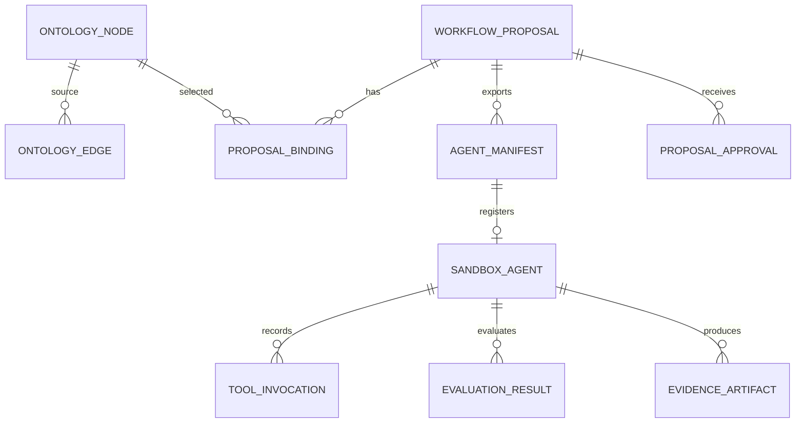

# Governed ontology and reference catalog

The SQLite ontology is the allowlisted catalog for workflow design. `OntologyNode` stores a governed concept and its discoverability metadata; `OntologyEdge` records a directed, typed rationale. It is not a graph database or customer corpus. It holds neither real loan documents nor live connector credentials. Providers receive compact eligible metadata; the proposal resolver then independently checks all returned slugs.

The canonical model is `studio/models.py`; reference data begins in `studio/migrations/0002_seed_reference_ontology.py`, with discovery-domain/search metadata added in `0008_catalog_discovery_metadata.py`.

This relationship model lets a proposal reuse catalog concepts while retaining a distinct immutable manifest and sandbox evidence trail.

## Concept and edge contract

`NodeType` includes business outcomes, user roles, data products, systems, connectors, tools, agent capabilities/instances, workflows, controls, and delivery artifacts. Every node has a globally unique slug, owner, classification, approval state, and optional source reference. `business_domain` and curated `search_terms` power explainable discovery; they must not contain customer data.

`OntologyEdge` uses `RelationType` values such as `uses`, `reads`, `invokes`, `instance_of`, `constrained_by`, and `produces`. `(source, relation, target)` is unique; node deletion cascades edges. The `rationale` is displayed to explain the catalog path rather than inferred at runtime.

`WorkflowProposal.existing_workflow`, `ProposalBinding.node`, `ControlCheck.control`, and runtime records preserve governance links with `PROTECT` where applicable. Proposal-owned bindings, approvals, manifests, and proof records otherwise cascade from a proposal; a sandbox instance protects its manifest. The complete proposal and approval semantics are canonical in [the proposal lifecycle](../workflows/proposal-lifecycle.md); runtime records are canonical in [the sandbox runtime](../workflows/sandbox-runtime.md).

## Eligibility and executable boundary

`build_ontology_context()` includes only `approved` or `conditional` nodes and edges between them. `_resolve_draft_nodes()` applies that same state check after a provider returns, rejecting unknown, draft, and retired slugs before persistence. This is the anti-invention gate.

[Catalog discovery](catalog-discovery.md) similarly filters discoverable node types to approved/conditional records, applies `BusinessDomain` and classification scope, ranks the metadata, then follows registered workflow edges. The catalog contains commercial-loan, treasury, retail, and platform/delivery concepts. Only the commercial-loan path is executable, and only through the synthetic runtime; catalog nodes named tools/connectors continue to describe target architecture rather than live source integrations.

## Migration and change guidance

The schema began in `0001_initial.py`; the reference corpus is seeded by `0002`; label neutralization in `0003` is irreversible (`RunPython.noop`); `0004` adds documentation/index metadata; `0005`–`0007` introduce and backfill manifest/evaluation/evidence records; and `0008` adds catalog-discovery metadata. Add changes through a new migration rather than editing applied migrations. Preserve slugs consumed by `DemoLlmProvider`, discovery expectations, tests, persisted bindings, and synthetic runtime fixtures—or deliberately migrate all consumers/data together.

For a catalog extension: add nodes/edges with rationale, set an appropriate approval state/domain/classification, add search terms only when it should be discoverable, and decide whether the new concept must be emitted by the provider, bound by a proposal, or executed by the synthetic runtime. Metadata alone does not make a source adapter real.

Run `.venv/bin/python manage.py migrate` then `.venv/bin/python manage.py test`. `StudioJourneyTests.test_catalog_discovery_resolves_each_registered_business_domain` catches domain/path regressions; `test_demo_provider_creates_controlled_proposal` catches renamed canonical proposal slugs; `test_complete_synthetic_sandbox_vertical_slice` catches missing runtime-bound tool data. Production/static checks are unnecessary for an ordinary migration.