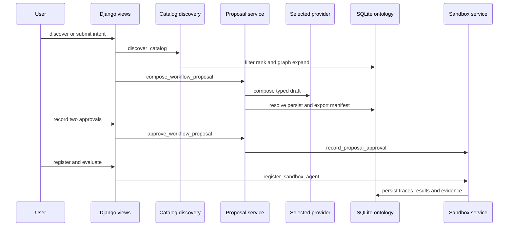

# Governed AI Studio architecture

This Django 5.2 prototype turns bounded business intent into a reviewable workflow specification. A deterministic discovery step finds approved catalog paths; a demo or optional LLM drafts a typed proposal; services resolve every catalog reference and export a manifest; two distinct human roles approve a synthetic-sandbox registration; then deterministic tools, evaluations, and evidence demonstrate the controlled path. The executable application is `studio`; `config` supplies Django composition.

The boundaries remain deliberate. The repository does **not** connect to Midland or any production source, grant a real entitlement, authenticate an approver on public workflow routes, deploy an agent, or make a production decision. The implemented runtime is one in-memory synthetic commercial-loan slice, not a live integration platform.

This is the implemented browser-to-sandbox path. Discovery can surface treasury and retail metadata, but only the commercial-loan result can continue into the synthetic runtime.

## Composition roots and public surface

- `manage.py` selects `config.settings`; `config/wsgi.py` and `config/asgi.py` expose deployment applications.
- `config/urls.py` mounts admin at `/admin/`, browser reload at `/__reload__/`, and `studio.urls` at `/`.
- `studio/urls.py` exposes the dashboard, catalog discovery, proposal compose/detail/approval, manifest download, sandbox registration/evaluation, and evidence download routes. The HTTP contracts and HTMX behavior belong to [the workspace guide](../web/workspace.md).
- `studio/views.py` validates forms and renders hypermedia. It dispatches discovery to [catalog discovery](catalog-discovery.md), proposal composition to [the proposal lifecycle](../workflows/proposal-lifecycle.md), and the post-approval slice to [the synthetic sandbox runtime](../workflows/sandbox-runtime.md).

## Main subsystems

1. **Ontology and reference catalog** — normalized concepts, typed relationships, discovery metadata, proposal bindings, and persisted evidence share SQLite storage. Read [the ontology guide](ontology.md).
2. **Catalog discovery** — hard access-profile filters, explainable scoring, and typed graph expansion choose reuse, access-mismatch, or metadata-gap outcomes. Read [catalog discovery](catalog-discovery.md).
3. **Proposal lifecycle** — typed provider output is grounded, control-checked, persisted, and exported as a sandbox-only manifest. Read [the proposal lifecycle](../workflows/proposal-lifecycle.md).
4. **Synthetic sandbox runtime** — dual simulated identities and bound tools produce deterministic findings, evaluation results, and hashable artifacts after dual approval. Read [the sandbox runtime](../workflows/sandbox-runtime.md).
5. **Model providers** — demo, Gemini, and Anthropic adapters form the only optional network integration boundary. Read [model providers](../integrations/model-providers.md).
6. **Workspace and operations** — server-rendered HTMX transport is documented in [the workspace guide](../web/workspace.md); settings, audit, static delivery, and authority limits are documented in [runtime operations](../operations/runtime-and-delivery.md).

## Change navigation and validation

Consult this page for a cross-system route or lifecycle change. Start with the first delegated service rather than putting business logic in a view. `StudioJourneyTests.test_complete_synthetic_sandbox_vertical_slice` covers manifest export, approvals, registration, evaluation, artifact hashes, and idempotent repeated operations; `test_discovery_endpoint_explains_path_and_execution_boundary` covers discovery as a read-only request. Run `.venv/bin/python manage.py test` for a change crossing these boundaries. `manage.py check` is sufficient for settings/route configuration only; CSS and `collectstatic` are conditional on static-source or delivery changes.