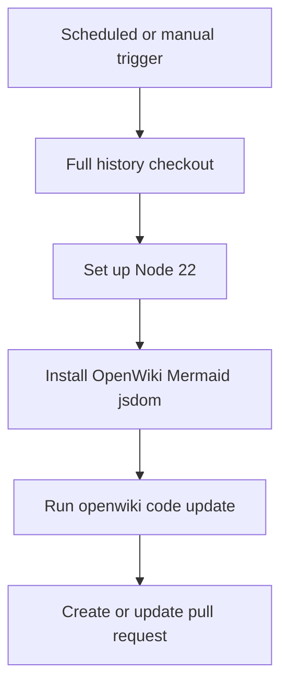

# OpenWiki update automation

`.github/workflows/openwiki-update.yml` is a separately operational workflow, not application runtime code. It can be started with `workflow_dispatch` or runs daily at `0 8 * * *`. Its job checks out history, installs documentation tooling, runs OpenWiki update mode, then creates or updates an `openwiki/update` pull request.

## Execution sequence

The full checkout is required because `openwiki code --update` diffs against the commit it last documented; a shallow clone can make its change summary empty.

## Permissions, credentials, and effects

The workflow requests `contents: write` and `pull-requests: write`. The PR action adds only `openwiki`, `AGENTS.md`, `CLAUDE.md`, and `.github/workflows/openwiki-update.yml`; it uses a fixed branch, commit message, and title. Review that constrained path scope when changing automation—this job can write repository content through the PR mechanism. In this current checkout Git has no commits yet, so the normal `gitHead` comparison has no usable baseline until an initial commit exists.

It globally installs pinned `openwiki@0.3.3`, `mermaid@11.16.0`, and `jsdom@29.1.1`, then runs `openwiki code --update --print`. Environment configuration selects `openai-chatgpt` and `gpt-5.6-terra`, passes `OPENWIKI_LANGSMITH_API_KEY` from a GitHub secret, and optionally enables LangSmith tracing with `LANGSMITH_API_KEY`, `LANGCHAIN_PROJECT`, and `LANGCHAIN_TRACING_V2`.

The comments identify an important unattended-run caveat: browser-based OpenAI ChatGPT login has no unattended equivalent, so CI credentials must be provided separately. Never replace secret expressions with values in this YAML, PR body, generated wiki, or logs.

## Generated-content ownership

`AGENTS.md` establishes the OpenWiki maintenance direction; OpenWiki pages are generated content and should not be manually edited as a substitute for a source-grounded update. The workflow deliberately includes `AGENTS.md`, `CLAUDE.md`, and its own YAML in the PR path scope because they influence agent documentation behavior. `openwiki/INSTRUCTIONS.md` is the user-authored brief and remains a scope input rather than generated content.

## Failure and change surface

Failures can arise from absent CI credentials, provider/API availability, an incorrect model configuration, unavailable global npm packages, Mermaid/jsdom validation changes, shallow history, or a PR write-permission restriction. A successful workflow does not validate Django behavior; application validation remains `.venv/bin/python manage.py test` as described in [`runtime-and-delivery.md`](runtime-and-delivery.md).

When altering this workflow, preserve full-history checkout unless update semantics change, assess permissions and secret use, retain reviewable path limits, and perform a manual dispatch in a safe branch/repository context. The application architecture is documented in [`../architecture/overview.md`](../architecture/overview.md).
