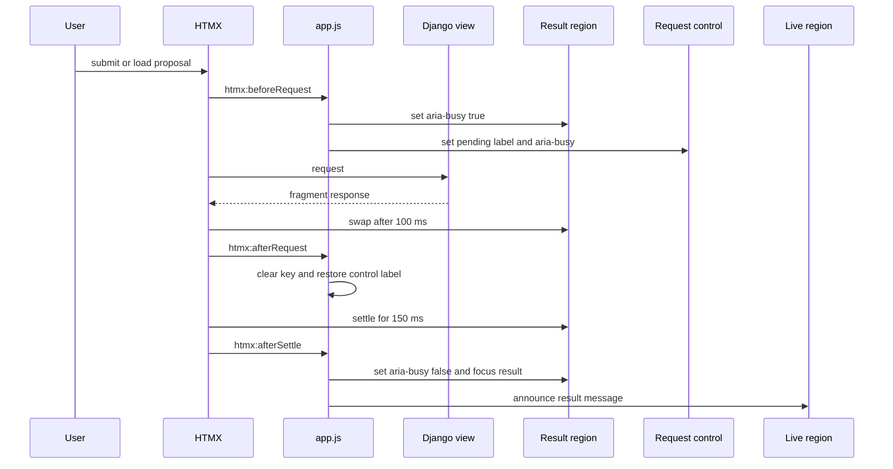

# Django and HTMX proposal workspace

The public application is a server-rendered Django workspace, not a REST API. `studio/urls.py` maps the dashboard, discovery, proposal, manifest, sandbox, and evidence paths to `studio.views`; `dashboard.html` keeps catalog/discovery and proposal work in client-selected sections while HTMX replaces results in place. The business semantics belong to [`workflows/proposal-lifecycle.md`](../workflows/proposal-lifecycle.md), [`architecture/catalog-discovery.md`](../architecture/catalog-discovery.md), and [`workflows/sandbox-runtime.md`](../workflows/sandbox-runtime.md); this page owns HTTP transport, plain-language presentation, and browser interaction.

## Routes and server-rendered contract

| Route | Method | View | Outcome |
|---|---|---|---|
| `/` | GET | `dashboard` | Renders the workspace, `REFERENCE_INTENT`, up to eight newest proposals, ontology nodes and edges, and provider-readiness booleans. An unknown `section` becomes `overview`. |
| `/catalog/discover` | POST | `discover` | Validates `DiscoveryForm` and returns a read-only explainable catalog result; invalid input returns 422. The algorithm and continuation boundary are in [`catalog discovery`](../architecture/catalog-discovery.md). |
| `/proposals/compose` | POST | `compose_proposal` | Validates `ProposalForm`, composes a proposal, returns a proposal partial, and sends `HX-Trigger: proposalCreated`. Invalid form, provider, or catalog input returns an error partial with 422; unanticipated provider failure returns 502. |
| `/proposals/<proposal_id>` | GET | `proposal_detail` | With `HX-Request`, returns only the proposal partial; otherwise returns the direct-link `proposal_page.html`. The response varies by `HX-Request`. |
| `/proposals/<proposal_id>/approve` | POST | `approve_proposal` | Validates `ApprovalForm`, records one role-specific approval, returns replacement partial markup, and sends `HX-Trigger: proposalApproved`. Invalid form returns 422; unmet approval policy returns 409. |
| `/proposals/<proposal_id>/manifest` | GET | `download_manifest` | Returns the exact stored canonical manifest JSON as an attachment with its hash as `ETag`. |
| `/proposals/<proposal_id>/sandbox/register` | POST | `register_sandbox` | Registers an approved manifest through the mocked orchestration boundary; unmet prerequisites return 409. |
| `/proposals/<proposal_id>/sandbox/evaluate` | POST | `evaluate_sandbox` | Runs the deterministic synthetic evaluation for a registered agent; missing registration/policy failures return 409. |
| `/proposals/<proposal_id>/evidence/<artifact_type>` | GET | `download_evidence` | Returns an exact stored JSON evidence artifact as an attachment with its hash as `ETag`. |

All view verbs use `require_GET` or `require_POST`. `base.html` adds the CSRF header and makes 422, 409, and 502 responses swappable. Discovery does not mutate catalog/proposal rows; sandbox routes delegate to the guarded runtime transitions in [`workflows/sandbox-runtime.md`](../workflows/sandbox-runtime.md). These routes have no login or permission decorator, a prototype limitation documented in [`operations/runtime-and-delivery.md`](../operations/runtime-and-delivery.md).

## Workspace copy and section state

`dashboard` initializes `ProposalForm.intent` from the `REFERENCE_INTENT` constant. The visible reference case is **Commercial loan insurance covenant review**. Its overview explains, in plain language, that a servicing question becomes a reviewable agent specification: intent is captured, approved catalog dependencies are matched, a typed proposal is drafted, code checks policy, a named person decides, and a sandbox package is prepared. It explicitly stops before deployment or source access.

The Alpine `x-data` object in `dashboard.html` owns six section identifiers, `section`, `drawerOpen`, `provider`, and `model`.

- `showSection(value, updateUrl = true)` accepts only a known section; otherwise it uses `overview`. It closes the drawer, writes `?section=` using `history.pushState` when appropriate, and after Alpine's next DOM tick focuses the selected section's `h1`. A `popstate` listener reruns it without writing history.
- `pickProvider(value)` changes both the selected provider and `model`: `gemini` uses the server-provided Gemini default, `anthropic` the Anthropic default, and `demo` uses `deterministic-demo-v1`.
- The **Ephemeral API key** panel is hidden for the demo route and shown only when `provider !== 'demo'`. Its Alpine enter transition is 150 ms ease-out and leave transition is 100 ms ease-in; `x-cloak` prevents it flashing before Alpine starts. The form explains that the matching environment variable can supply a key and that the server does not store submitted keys.

Provider/model selection changes browser fields only. The actual provider is validated by `ProposalForm.clean_provider` and constructed by the service path described in [`integrations/model-providers.md`](../integrations/model-providers.md); no browser state grants a provider permission.

## Primary-navigation icon component

The drawer's six primary links in `studio/templates/studio/dashboard.html` invoke the reusable `django-components` tag as ``. `MenuIcon` in `studio/components/menu_icon/menu_icon.py` is registered under that tag name and accepts one typed keyword, `name`. Its `_ICON_NAMES` allowlist is deliberately closed: `overview`, `ontology`, `catalog`, `connections`, `workflow`, and `proposals`. `get_template_data()` raises `ValueError` for any other value instead of silently selecting a wrong or absent glyph.

| Controlled name | Link text and section | SVG role in `menu_icon.html` |
|---|---|---|
| `overview` | Overview / `overview` | Four-panel dashboard |
| `ontology` | Ontology map / `ontology` | Connected three-node graph |
| `catalog` | Catalog / `catalog` | Book/catalog |
| `connections` | Connector model / `connections` | Linked endpoints |
| `workflow` | Start workflow / `compose` | Play symbol in a circle |
| `proposals` | Proposal registry / `proposals` | Document with rows |

The component intentionally has no accessible name: its `<svg>` uses `aria-hidden="true"` and `focusable="false"`, while the adjacent `` inside the anchor supplies the link name. Preserve that division: do not add a title, `aria-label`, or focusability to these icons unless the component is repurposed without visible link text. `data-menu-icon="{{ name }}"` is a rendered identifier for the controlled variant, not an accessibility substitute.

The SVG has `stroke="currentColor"`, so it inherits the anchor's semantic `secondary-content` color rather than carrying its own palette literal. The [theme system](theme-system.md) defines the linked navy-surface color and opacity states: `.menu-icon` starts at `0.72` opacity, then becomes fully opaque on hover, `:focus-visible`, and `.menu-active`. This keeps mouse, keyboard, and selected-page feedback aligned without separate icon assets or state-specific component parameters.

### Component change recipe

1. **Add or change a navigation icon atomically.** Update `_ICON_NAMES`, the matching conditional branch in `menu_icon.html`, and the consuming `dashboard.html` link together. A new name without an SVG branch would render an empty decorative SVG; a template name outside the allowlist raises at render time.
2. **Keep the public consumer and startup paths intact.** `django_components` is in `INSTALLED_APPS`; `django_components.template_loader.Loader` and `COMPONENTS["app_dirs"]` support component templates/assets. Separately, `COMPONENTS["libraries"]` explicitly imports `studio.components.menu_icon.menu_icon` and `studio.components.status_badge.status_badge` at Django startup, executing `@register("menu_icon")` and `@register("status_badge")`. This deterministic list prevents stale development-autoreloader discovery after a new Python component module is added; it is not registration by autodiscovery alone. Add a new registration module to `libraries` and restart/reload the development server after changing settings. Consumers continue to use ``, not a direct template include.
3. **Keep style extraction and generated output synchronized.** `studio/assets/css/input.css` includes `@source "../../components"`, so component-template utility classes are visible to Tailwind. Run `npm run build:css` if those classes or `input.css` change; `studio/static/studio/css/app.css` is generated and must not be hand-edited.
4. **Validate both layers.** `StudioJourneyTests.test_dashboard_has_accessible_structure_and_labels` asserts six rendered `data-menu-icon` attributes, the expected SVG class, and `aria-hidden="true"`; `test_dashboard_explains_reference_use_case` verifies the dashboard renders HTTP 200. Run the latter narrowly with `.venv/bin/python manage.py test studio.tests.StudioJourneyTests.test_dashboard_explains_reference_use_case --verbosity 0`, or run `.venv/bin/python manage.py test` when changing the broader component/template contract. These checks exercise the consumer-rendered surface, whereas `_ICON_NAMES` validation is internal. Manually check hover, keyboard focus, and active-section contrast when changing icon CSS or theme tokens. Production `collectstatic` is unnecessary unless static-delivery settings or production artifact behavior also change.

## HTMX replacement lifecycle

The compose form targets `#proposal-workspace` with `innerHTML`; proposal-registry buttons target `#proposal-registry-detail` with `innerHTML`; the approval form targets its own proposal article with `outerHTML`. All three declare `swap:100ms settle:150ms`. The 100 ms delay gives the outgoing result region time to enter its CSS swap state; the 150 ms settle window gives newly inserted markup time to assume its final visual state before `htmx:afterSettle` runs.

This shows the implemented successful HTMX path; failures follow the same control/key cleanup, clear the target busy state in `htmx:afterRequest`, and receive a generic failure announcement.

`studio/static/studio/js/app.js` defines the browser-side ordering:

1. On `htmx:beforeRequest`, it sets `aria-busy="true"` on the request target. If the triggering element contains `input[name='api_key']`, it also marks that input busy. `getRequestControl()` locates either the triggering element itself or its descendant with `data-loading-label`, saves its current `aria-label` in `data-idle-label`, replaces the accessible name with the request-specific loading label, and marks that control busy.
2. On `htmx:afterRequest`, it clears that API-key input and removes its busy attribute regardless of outcome. It restores and removes the saved control label state, then removes control `aria-busy`. On an unsuccessful request it immediately clears the target busy state and writes **“The request could not be completed.”** into `#studio-announcer`.
3. On `htmx:afterSettle`, it clears target busy state, finds either the target itself or a descendant with `data-result-focus`, focuses it, and replaces the live-region text with its `data-announcement` value or **“Content updated.”**.

`proposal_detail.html` makes the proposal article focusable and supplies an announcement containing its ID and status. `proposal_error.html` similarly makes its alert focusable and announces that the proposal was not created. `base.html` supplies their shared destination: `#studio-announcer` is an atomic, polite `role="status"` live region. Focus and success/status speech intentionally occur after settling, so assistive technology encounters the final replacement content rather than the outgoing fragment.

### Request controls and duplicate-submit prevention

The request source owns the visible pending state, while `app.js` owns the corresponding accessible-name and busy lifecycle:

- The compose form and the proposal approval form use `hx-disabled-elt="find button[type='submit']"`. HTMX disables the relevant submit button during its own request, preventing a second activation from producing a duplicate compose or approval POST. Their buttons carry `data-loading-label="Drafting proposal"` and `data-loading-label="Approving proposal"`, respectively.
- Proposal-registry buttons use `hx-disabled-elt="this"`, so the selected row cannot be reactivated while its GET is in flight. The row exposes `data-loading-label="Loading proposal #<id>"`; Django renders the concrete proposal number, so the temporary accessible name identifies the request rather than using a generic loading label.
- Each control has overlapping idle and pending visible text in `.request-label`; CSS toggles opacity under HTMX's `.htmx-request` class. The spinner is present but `aria-hidden`, making the JavaScript-updated `aria-label` the status exposed to assistive technology. `aria-busy` remains on the target until settlement and on the triggering control only until request completion.

This browser feedback is transport-layer behavior: it accompanies the compose and approval transactions owned by [`workflows/proposal-lifecycle.md`](../workflows/proposal-lifecycle.md), but it does not change their server-side idempotence or policy rules.

## Ontology catalog disclosure

The ontology section renders each `OntologyNode` as native `
` with `class="ontology-node collapse collapse-arrow"`; the summary shows the type, approval state, and name, while the expanded body reveals description, owner, classification, and slug. This is a daisyUI collapse interaction backed by the browser's `open` state, not Alpine or an additional endpoint. `input.css` gives an item either hover or `[open]` border/shadow feedback. The expanded information is the same catalog metadata and eligibility boundary documented in [`architecture/ontology.md`](../architecture/ontology.md); the interaction does not fetch source data or alter a node.

## Visual feedback and motion preferences

`studio/assets/css/input.css` supplies the visual counterpart to those HTMX timings. Its palette and daisyUI semantic-role contract have one canonical home in [the institutional theme guide](theme-system.md); this page only describes the interaction rules that consume it.

- `html` defines the shared interaction vocabulary: `--motion-feedback: 120ms` for immediate control feedback, `--motion-settle: 150ms` for inserted content, `--ease-enter`, and `--ease-exit`. Drawer links, registry controls, request labels, indicators, ontology disclosure, and fragment/proposal transitions consume these tokens where their timings apply. The HTMX attributes still explicitly use `swap:100ms settle:150ms`; if changing the settle duration, keep the 150 ms attribute and `--motion-settle` aligned.
- `.fragment-transition` and `.proposal-transition` normally transition opacity and vertical transform using `--motion-settle`. During `.htmx-swapping`, the outgoing region fades and moves up over a fixed 100 ms exit. During `.htmx-settling` or when a proposal is `.htmx-added`, the incoming region starts transparent and 0.375 rem lower, then settles through the normal rule.
- The compose form's `hx-indicator="#compose-spinner"` reserves the spinner in the submit button. Registry rows include their own indicator. `.htmx-indicator` is visually hidden through `visibility` and opacity instead of being removed from layout; HTMX's request class makes it visible and scales it to full size. `.registry-trigger.htmx-request` additionally shows a progress cursor and reduced opacity. These choices provide loading feedback without changing layout.
- The overview control-route line uses the `route-draw` animation, and Alpine sections/panels use their template transitions. The broad `prefers-reduced-motion: reduce` rule disables smooth scrolling and makes animation/transition durations effectively instantaneous. The later targeted rule removes transforms and sets an 80 ms linear transition for fragment/proposal transitions, the provider-key panel, and indicator. Do not add motion that bypasses either media-query rule.

## Change navigation and validation

Consult this page when changing form markup, user-facing proposal copy, client navigation, HTMX behavior, result accessibility, or CSS interactions. Keep the following contracts together:

| Change | Owning files and symbols | Required invariant | Focused evidence | Minimal validation |
|---|---|---|---|---|
| Change reference-case wording or sections | `studio/views.py`: `REFERENCE_INTENT`, `dashboard`; `studio/templates/studio/dashboard.html` | Copy must continue to state the prototype stops before source access/deployment; valid navigation focuses the active section heading. | `StudioJourneyTests.test_dashboard_explains_reference_use_case` | `.venv/bin/python manage.py test` |
| Add or change a primary-navigation icon | `studio/components/menu_icon/menu_icon.py`: `MenuIcon`, `_ICON_NAMES`; `menu_icon.html`; `config/settings.py`: `COMPONENTS["libraries"]`; `dashboard.html`; `input.css`: `.menu-icon` | Keep the six-name allowlist, matching SVG branch, component-tag consumer, and deterministic startup-library entry in sync. The SVG remains decorative (`aria-hidden`, not focusable), takes its color through `currentColor`, and changes from `0.72` to full opacity on hover, focus-visible, or active link. | `StudioJourneyTests.test_dashboard_has_accessible_structure_and_labels` asserts six rendered variants, class, and decorative state; `test_dashboard_explains_reference_use_case` verifies HTTP 200 rendering. | `.venv/bin/python manage.py test studio.tests.StudioJourneyTests.test_dashboard_explains_reference_use_case --verbosity 0`; `npm run build:css` if component classes or CSS change; manually inspect hover/focus/active contrast. |
| Change provider selector or API-key panel | `dashboard.html`: `pickProvider`, `provider-key-panel`; `studio/forms.py`; `studio/static/studio/js/app.js` | Demo maps to `deterministic-demo-v1`; live selection displays the optional ephemeral-key route; every HTMX request clears a submitted key. | `StudioJourneyTests.test_dashboard_has_accessible_structure_and_labels`; `test_demo_provider_creates_controlled_proposal` | `.venv/bin/python manage.py test` plus a manual provider-toggle check |
| Change a compose, registry, or approval swap | `dashboard.html`; `partials/proposal_detail.html`; `app.js`; `input.css` | Keep the matching target, 100 ms swap, 150 ms settle, busy lifecycle, request-specific control label, and direct-link partial behavior aligned. | `StudioJourneyTests.test_demo_provider_creates_controlled_proposal` checks approval swap markup. | `.venv/bin/python manage.py test` plus a manual HTMX success and 422-error check |
| Change duplicate prevention or loading feedback | `dashboard.html`: compose form, registry button; `partials/proposal_detail.html`: approval form; `app.js`: `getRequestControl`; `input.css`: `.request-label`, `.registry-trigger`, `.htmx-indicator` | Compose/approval disable their submit button, the registry disables its selected button, and each request temporarily exposes the matching `data-loading-label` and `aria-busy` state. | `StudioJourneyTests.test_dashboard_has_accessible_structure_and_labels` checks compose disabling and labels; `test_demo_provider_creates_controlled_proposal` checks approval loading metadata. | `.venv/bin/python manage.py test`; manually confirm each pending state if changing JavaScript or CSS |
| Change ontology disclosure | `dashboard.html`: ontology `
`; `input.css`: `.ontology-node` | Preserve native `details`/`summary` semantics and make `[open]` feedback work without a request or client-side state store. | `StudioJourneyTests.test_dashboard_has_accessible_structure_and_labels` checks `collapse collapse-arrow`. | `.venv/bin/python manage.py test`; `npm run build:css` if CSS changes |
| Change result focus, announcement, or motion | `base.html`, result/error partials, `app.js`, `input.css` | After settlement, focus reaches `data-result-focus` and `#studio-announcer` receives the tailored message; reduced-motion avoids normal movement. Keep `--motion-settle` aligned with HTMX's 150 ms settle window. | `StudioJourneyTests.test_dashboard_has_accessible_structure_and_labels` anchors landmarks/status role; manual keyboard, screen-reader, and reduced-motion checks remain necessary. | `npm run build:css` when CSS changes; `.venv/bin/python manage.py test` |

When changing `studio/assets/css/input.css`, run `npm run build:css`; `studio/static/studio/css/app.css` is generated output and should not be hand-edited. Full browser checks are conditional rather than replacements for the tests: use them when changing focus, live announcements, request labels, disabled controls, HTMX timing, disclosure styling, provider-panel state, or motion behavior. Verify a successful composition, a 422 error response, a proposal-registry load, and an approval; in each case confirm no repeat activation while pending, the specific temporary label, appropriate `aria-busy` reset, keyboard focus after the swap, a screen-reader announcement, and `prefers-reduced-motion` behavior. Wider production checks such as `collectstatic` are unnecessary unless static-delivery configuration changes.