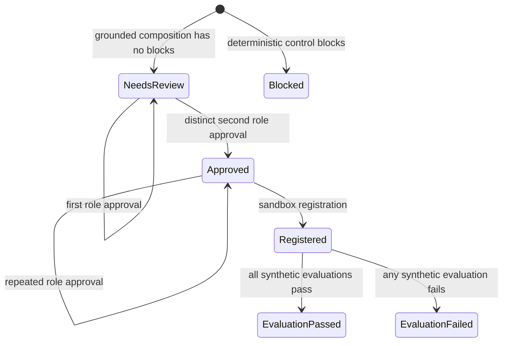

# Governed proposal and approval lifecycle

`studio.services.compose_workflow_proposal()` owns intent composition and deterministic proposal policy. It creates a reviewable `WorkflowProposal`, its bindings/checks/proof events, and a versioned `AgentManifest`. `approve_workflow_proposal()` is a thin policy guard that delegates role-specific approval recording to `sandbox_services.record_proposal_approval()`. Views validate forms and select markup; they do not own lifecycle decisions.

`Approved` means approved for the mocked sandbox only. The detailed execution states and their evidence are owned by [the synthetic sandbox runtime](sandbox-runtime.md).

## Composition transaction

1. `build_ontology_context()` serializes approved/conditional nodes and edges.
2. `build_llm_provider()` returns a demo or live adapter. Its typed `ProviderResult` contract is documented in [model providers](../integrations/model-providers.md).
3. `_resolve_draft_nodes()` collects every capability, optional workflow, binding, control, and delivery slug. Unknown, retired, or draft records fail before persistence.
4. `_risk_level()` derives high risk for `write`/`communicate`, moderate risk for confidential/restricted bindings, and low otherwise. `_evaluate_controls()` produces deterministic results.
5. `_persist_proposal()` atomically persists the proposal, de-duplicated bindings, checks, initial proof events, and then calls `export_agent_manifest()`.

Provider invocation occurs before the database transaction and cannot be rolled back. Manifest export occurs inside the transaction after normalized bindings exist. `export_agent_manifest()` is idempotent for `MANIFEST_VERSION` and produces canonical JSON plus a SHA-256 hash; it records `MANIFEST_EXPORTED`. The artifact is sandbox-only and prohibits production eligibility. Its download endpoint and use after approval are documented in [the sandbox runtime](sandbox-runtime.md).

## Grounding, bindings, and proposal policy

`_resolve_draft_nodes()` is the anti-invention gate, while `_binding_kind_for_node()` rejects node types that cannot participate directly. `_create_bindings()` always binds the selected capability as an invoking agent; it maps data products to `data/read`, tools/connectors to `tool/invoke`, agent nodes to `agent/invoke`, controls to `control/enforce`, and delivery artifacts to `delivery/generate`. The `seen` set avoids duplicate `(node, kind)` records before the database uniqueness constraint.

The ontology's eligibility and migration rules are canonical in [the ontology guide](../architecture/ontology.md). The provider's Pydantic validation is structural only; it does not replace this resolver.

| Deterministic check | Blocking condition |
|---|---|
| Registered and approved assets | Never blocks after successful resolution; records the grounding result. |
| Entitlement before retrieval | `user-entitlement-check` omitted. |
| Evidence and citations | `citation-required` omitted. |
| Human authority | `human-review-required` omitted. |
| Read-only action boundary | Intent action is `write` or `communicate`. |
| Reuse before build | Warning, rather than block, when no existing workflow is selected. |

`read-only-boundary` and `data-minimization` may be bindings but are not omission checks. The policy is code, not a prompt instruction.

## Dual approval invariant

`record_proposal_approval()` requires a non-blocked proposal with a manifest. `ProposalApproval` is unique by `(proposal, review_role)`: a repeated role submission returns the existing approval. Before creating the other role's approval, the service compares `approver` case-insensitively and rejects a match, enforcing distinct business-owner and source-owner reviewers. Only the exact set `{BUSINESS_OWNER, SOURCE_OWNER}` sets the proposal status to `approved` and appends `SDLC_PACKAGE_READY`.

The approval form still accepts a submitted name and public proposal routes have no identity decorator. Therefore the prototype demonstrates a separation-of-duties **data rule**, not authenticated institutional authority. `approved` enables [sandbox registration](sandbox-runtime.md); it is not a deployment or source-access grant. Runtime operations and audit boundaries are described in [runtime operations](../operations/runtime-and-delivery.md).

## Change recipe and focused tests

For an added governed capability, update the catalog migration first; then extend `ProposalDraft` and adapters only if the provider must emit new data; include that data in slug resolution/binding normalization; add deterministic policy if it is mandatory; and update `DemoLlmProvider` if the reference journey uses it. Do not treat a catalog tool node as an executable connector.

For approval changes, preserve the two role set, unique role key, case-insensitive distinct-reviewer rule, and manifest prerequisite. `StudioJourneyTests.test_dual_approval_releases_sandbox_registration` demonstrates status stays `needs_review` after the first approval and becomes `approved` only after the second. `test_approval_roles_enforce_separation_of_duties` verifies the same reviewer cannot supply both roles. Run the first narrowly with `.venv/bin/python manage.py test studio.tests.StudioJourneyTests.test_dual_approval_releases_sandbox_registration --verbosity 0`; run `.venv/bin/python manage.py test` for changes to lifecycle, model, manifest, or templates. Sandbox registration/evaluation checks are separate and described on [the sandbox runtime page](sandbox-runtime.md).